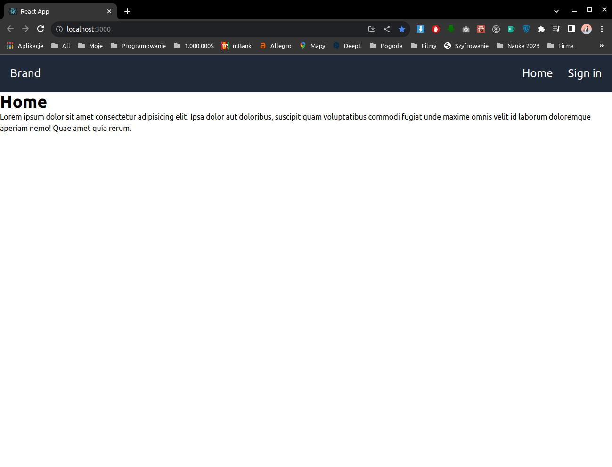
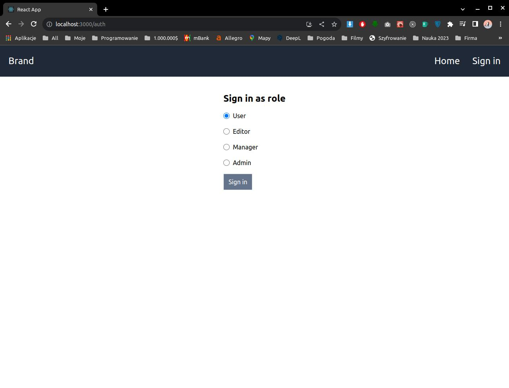
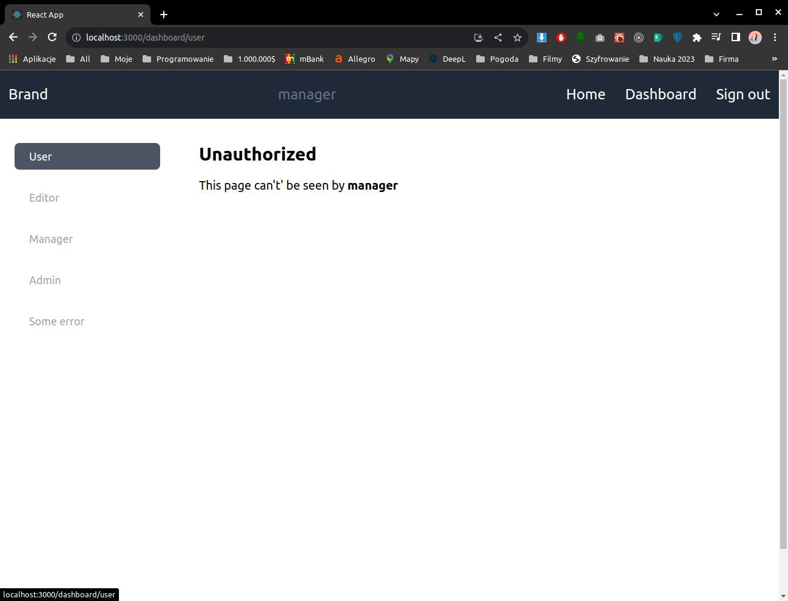
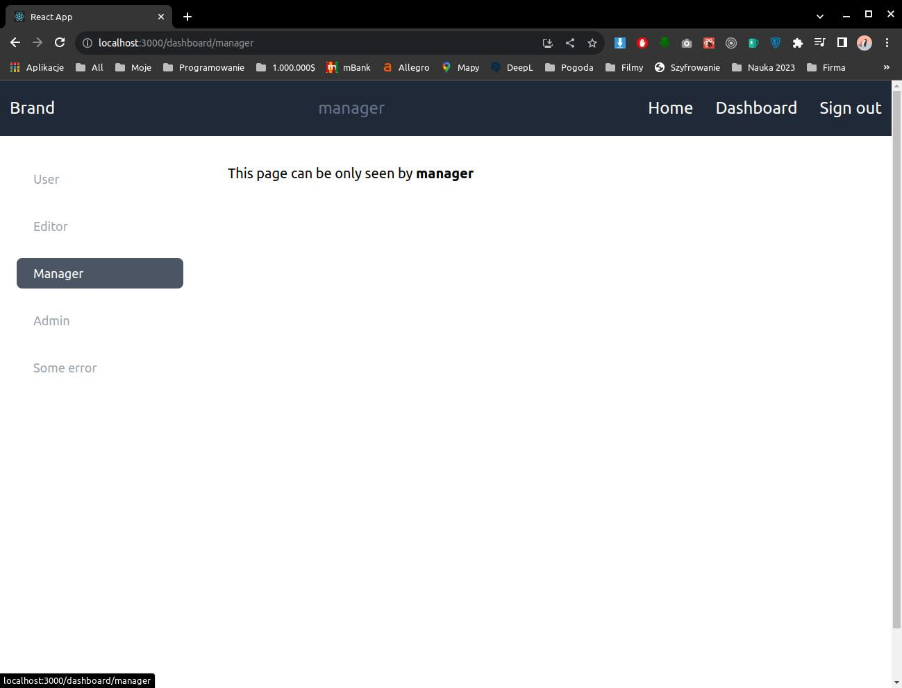

# react-router-features
Some React Router Dom new features v6+

```
$ npx create-react-app@latest ./ --template typescript

$ npm install -D tailwindcss postcss autoprefixer react-toastify react-router-dom
$ npx tailwindcss init -p
```

```js
// tailwind.config.js
content: [
    './src/**/*.{js,jsx,ts,tsx}',
],
```
```css
/* index.css */
@tailwind base;
@tailwind components;
@tailwind utilities;
```


### Home Page - no auth



### Sign in form



### User area

Manager not authorised to see that part of the app



### Manager area

Manager is athorised to see that part of the app


